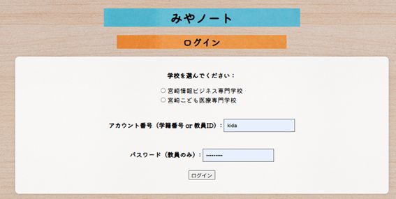
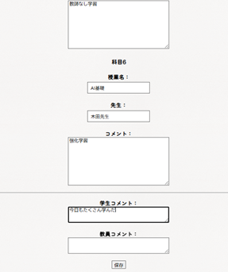
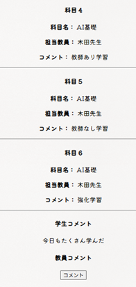
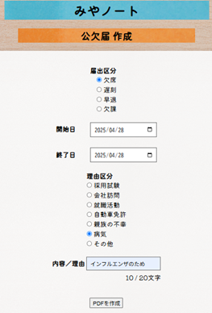
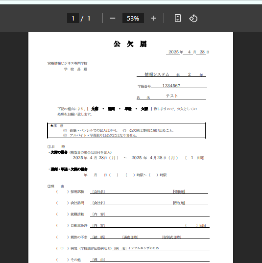

# みやノート Ver1.0

**― 学生・教員間の提出管理をDX化する教育支援システム ―**

---

## 📌 プロジェクト概要

- 教育現場における日誌提出、書類申請をオンライン化し、業務効率化を図るWebアプリケーション
- 学生と教員双方が使いやすいUI、コメント機能、提出物管理機能を実装
- Python / Djangoベースで開発
- 提出完了時にはDiscord通知も飛ぶリアルタイム共有機能を搭載

---

## ⚙️ 使用技術

- Python（3.x）
- Django（4.x）
- SQLite
- reportlab / PyPDF2（PDF出力）
- Discord Webhook連携
- ChatGPT活用による設計・デバッグ支援

---

## 🔥 主な機能

- 学生・教員ログイン機能（ユーザー権限制御）
- 日誌提出・確認・コメント返信機能
- 書類提出機能（公欠届・遅刻届・内定報告書など）
- 提出物の再提出・編集機能
- PDF自動出力機能（動的生成方式）
- 提出完了時のDiscord通知機能
- コメント欄分離（学生・教員コメントを別管理）

---

## 🖼️ 画面イメージ

▶ ログイン画面  

▶ 日誌提出画面  

▶ 日誌詳細画面（教員コメント機能付き）  

▶ 書類提出フォーム画面  

▶ 生成されたPDFサンプル  

▶ Discord通知サンプル  

---

## 🛠️ 開発スタイル・工夫した点

- アジャイル開発手法を取り入れ、教員・学生フィードバックを即反映
- ファイル保存型から、DB保存＋PDF動的生成型へアーキテクチャを刷新
- ChatGPTとの対話による設計・デバッグ支援で開発スピードと品質を向上
- 将来の機能拡張を見据え、Djangoへフレームワークを移行

---

## 🚀 今後の展望

- 書類機能のさらなる拡張（内定連絡書、進路希望書など）
- 他学科連携によるシステ
